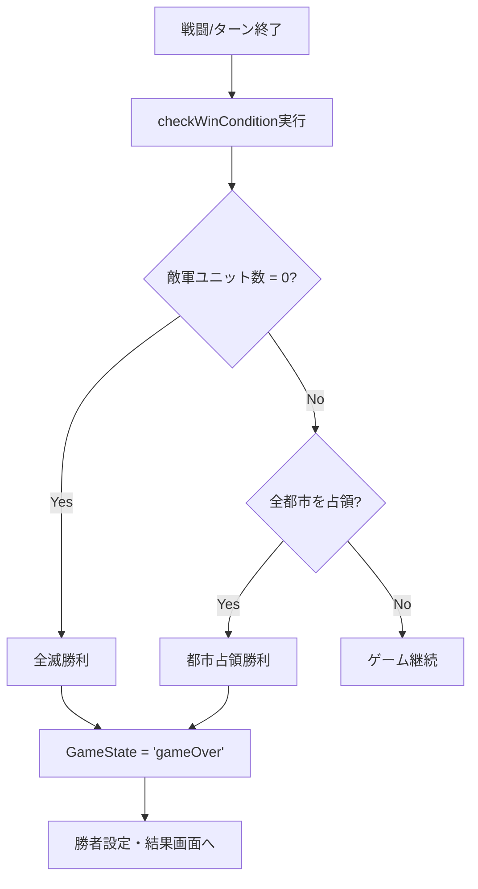

# 勝利条件仕様書

## 概要

hex-strategy-ww2 Commanderの勝利条件システムの詳細仕様書です。

## 勝利条件の種類

### 1. 全滅勝利（Unit Elimination Victory）

**条件**: 敵軍の全ユニットを撃破する

**実装場所**: `src/hooks/useGameLogic.ts:271-284`

```typescript
const checkWinCondition = useCallback((currentUnits: Unit[], currentBoard: BoardLayout) => {
  const blueUnits = currentUnits.filter(u => u.team === 'Blue');
  const redUnits = currentUnits.filter(u => u.team === 'Red');

  if (redUnits.length === 0) {
    setGameState('gameOver');
    setWinner('Blue');
    return;
  }
  if (blueUnits.length === 0) {
    setGameState('gameOver');
    setWinner('Red');
    return;
  }
```

- **優先度**: 最高（他の条件より先に判定）
- **判定タイミング**: 戦闘終了後、ターン終了時
- **対象ユニット**: HP > 0の全ユニット

### 2. 都市完全占領勝利（Total City Control Victory）

**条件**: マップ上のすべての占領可能都市を制圧する

**実装場所**: `src/hooks/useGameLogic.ts:286-298`

```typescript
const cities = Array.from(currentBoard.values()).filter(t => isCapturableTerrain(t.terrain));
const blueCities = cities.filter(c => c.owner === 'Blue').length;
const redCities = cities.filter(c => c.owner === 'Red').length;

if (cities.length > 0) {
  if (blueCities === cities.length) {
    setGameState('gameOver');
    setWinner('Blue');
  } else if (redCities === cities.length) {
    setGameState('gameOver');
    setWinner('Red');
  }
}
```

- **優先度**: 高（全滅勝利の次）
- **判定タイミング**: ターン終了時
- **対象地形**: `isCapturableTerrain()`で定義
  - City（都市）
  - Capital（首都）
  - Airport（空港）
  - Port（港湾）

## 占領システム

### 占領可能地形の定義

**実装場所**: `src/hooks/useGameLogic.ts:43-45`

```typescript
const isCapturableTerrain = (terrain: string): boolean => {
  return terrain === 'City' || terrain === 'Capital' || terrain === 'Airport' || terrain === 'Port';
};
```

### 占領メカニズム

**実装場所**: `src/hooks/useGameLogic.ts:695-716`

**条件**:
- ユニットタイプ: `Infantry`（歩兵）のみ
- ユニットクラス: `Infantry`
- アクション: `capture`コマンド実行

**プロセス**:
1. **ダメージ計算**:
   - 高HP時（HP > maxHp/2）: `CAPTURE_DAMAGE_HIGH_HP`範囲
   - 低HP時（HP ≤ maxHp/2）: `CAPTURE_DAMAGE_LOW_HP`範囲
   
2. **占領判定**:
   - 都市HP = 0 → 占領完了
   - 都市HP > 0 → 継続的な攻撃が必要

3. **占領後の効果**:
   - HP: `CITY_HP`に回復
   - 所有者: 攻撃側チームに変更

## 勝利判定フロー



## 勝利時の処理

**ゲーム状態更新**:
- `gameState`: 'playing' → 'gameOver'
- `winner`: 勝利チーム（'Blue' | 'Red'）

**結果画面**:
- 実装場所: `src/screens/ResultScreen.tsx`
- 表示情報:
  - 勝敗結果
  - 戦闘ターン数
  - 失ったユニット数
  - パフォーマンス評価

## 設定可能パラメータ

**定数定義場所**: `src/config/constants.ts`

- `CITY_HP`: 都市の初期/回復HP
- `CITY_HEAL_RATE`: 都市の自動回復量
- `CAPTURE_DAMAGE_HIGH_HP`: 高HPユニットの占領ダメージ範囲
- `CAPTURE_DAMAGE_LOW_HP`: 低HPユニットの占領ダメージ範囲

## 今後の拡張案

### 潜在的な勝利条件

1. **ターン数制限勝利**
   - 指定ターン経過後の都市数/ユニット数で勝敗判定

2. **首都占領勝利**
   - Capitalタイプの特別な地形を制圧

3. **ポイント制勝利**
   - 撃破ユニット・占領都市によるスコア計算

4. **生存勝利**
   - 指定ターン数を生き残る

### 実装上の考慮事項

- 勝利条件の優先順位システム
- カスタムシナリオでの勝利条件設定
- マルチプレイヤー対応時の同期処理

---

**最終更新**: 2025-08-06  
**バージョン**: 1.0.0  
**対応コミット**: feature branch