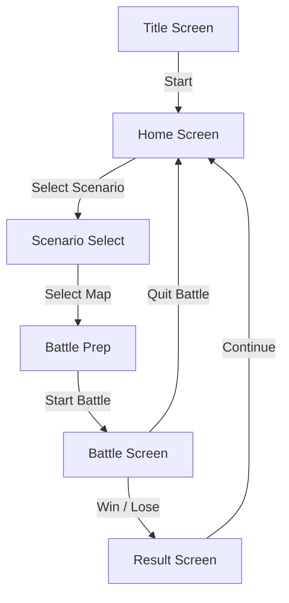

# 📖 画面仕様書

このドキュメントは、ゲーム「Commander」に登場する各画面の目的、機能、そして画面間の遷移について定義します。

---

## 画面遷移図

---

## 各画面の詳細

### 1. タイトル画面 (`TitleScreen`)
*   **目的**: ゲームの起動時にプレイヤーが最初に目にする画面。ゲームの世界観への導入。
*   **主な機能**:
    *   ゲームタイトルの表示。
    *   「Press Start」のような、ゲーム開始を促すメッセージの表示。
*   **画面遷移**:
    *   画面上の任意の場所をクリック、またはキーを押すことで **ホーム画面** に遷移します。

### 2. ホーム画面 (`HomeScreen`)
*   **目的**: ゲームのメインメニューとして機能し、各モードへの起点となる画面。
*   **主な機能**:
    *   **シナリオ開始**: 新しいゲームを開始するためのシナリオ選択画面へ進みます。
    *   **ロード**: （将来的に）保存されたゲームを再開します。
    *   **設定**: （将来的に）ゲームの音量や操作設定を変更します。
*   **画面遷移**:
    *   「シナリオ開始」を選択すると **シナリオ選択画面** に遷移します。

### 3. シナリオ選択画面 (`ScenarioSelectScreen`)
*   **目的**: プレイヤーがプレイしたいステージ（シナリオ）を選択する画面。
*   **主な機能**:
    *   プレイ可能なシナリオのリストを表示します。
    *   各シナリオの名称、説明、難易度などの概要情報を確認できます。
*   **画面遷移**:
    *   リストから特定のシナリオを選択すると、そのマップでの **戦闘準備画面** に遷移します。

### 4. 戦闘準備画面 (`BattlePrepScreen`)
*   **目的**: 戦闘開始前に、マップの確認やユニットの初期配置を行う画面。
*   **主な機能**:
    *   選択したシナリオのマップ全体図を表示します。
    *   （将来的に）出撃させるユニットを選択したり、指定されたエリア内にユニットを配置したりする機能。
*   **画面遷移**:
    *   「戦闘開始」ボタンを押すことで、**戦闘画面** に遷移し、ゲームが始まります。

### 5. 戦闘画面 (`BattleScreen`)
*   **目的**: ゲームプレイの中心となる画面。プレイヤーがユニットを操作し、勝利条件の達成を目指します。
*   **主な機能**:
    *   **ゲームボード**: ヘックスで構成されたマップ上に、自軍および敵軍のユニットが表示されます。
    *   **ユニット操作**: ユニットを選択し、移動、攻撃、占領、待機などのコマンドを実行します。
    *   **情報表示**: ユニットのステータス、地形効果、現在のターン数、天候など、ゲーム進行に必要な情報が常に表示されます。
    *   **ターン進行**: 「ターン終了」ボタンで自軍のターンを終え、敵軍のターンに移ります。
*   **画面遷移**:
    *   勝利または敗北条件が満たされると、**リザルト画面** に自動的に遷移します。
    *   メニューから「メインメニューに戻る」を選択すると、**ホーム画面** に戻ります。

### 6. リザルト画面 (`ResultScreen`)
*   **目的**: 戦闘の勝敗結果をプレイヤーに表示する画面。
*   **主な機能**:
    *   「勝利(You Win)」または「敗北(You Lose)」のメッセージを表示します。
    *   （将来的に）クリアターン数、失ったユニット数などの戦績を表示します。
*   **画面遷移**:
    *   「OK」や「ホームに戻る」などのボタンを押すことで、**ホーム画面** に遷移します。
